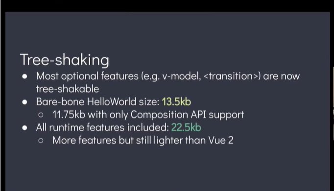

# tree shaking


[https://vue-next-template-explorer.netlify.app/](https://vue-next-template-explorer.netlify.app/#%7B%22src%22%3A%22%22%2C%22options%22%3A%7B%22mode%22%3A%22module%22%2C%22prefixIdentifiers%22%3Afalse%2C%22optimizeBindings%22%3Afalse%2C%22hoistStatic%22%3Afalse%2C%22cacheHandlers%22%3Afalse%2C%22scopeId%22%3Anull%7D%7D)


工具会从入口文件开始不断的获取你的依赖，就像一颗树一样从根节点开始不断往下延伸，只有被依赖的文件才会加入树，但是如果只是引用了依赖一部分代码，则把不需要的部分代码摇掉

##### 支持 tree shaking 的工具

> 1.closure compiler
> 2.rollup
> 3.webpack

##### 本质

- DCE（dead code elimination）
- 新的实现（javascript 绝大多数情况需要通过网络进行加载）
- 传统的 DCE 消灭不可能执行的代码，而 Tree-shaking 更关注宇消除没有用到的代码。

Tree-shaking, 也被称为 "live code inclusion," 它是清除实际上并没有在给定项目中使用的代码的过程，但是它可以更加高效。

> imagine that you made cakes by throwing whole eggs into the mixing bowl and smashing them up, instead of cracking them open and pouring the contents out. Once the cake comes out of the oven, you remove the fragments of eggshell, except that’s quite tricky so most of the eggshell gets left in there.
> [链接](https://medium.com/@Rich_Harris/tree-shaking-versus-dead-code-elimination-d3765df85c80#.jnypozs9n)

Dead Code(关注于代码)

> - 代码不会被执行，不可到达
> - 代码执行的结果不会被用到
> - 代码只会影响死变量（只写不读）
>   编译器将 Dead Code 从 AST（抽象语法树）中删除

tree-shaking(更关注于无用模块，ES6 的模块特性)

> - 只能作为模块顶层的语句出现
> - import 的模块名只能是字符串常量
> - import binding 是 immutable 的
>   ES6 模块依赖关系是确定的，和运行时的状态无关，可以进行可靠的静态分析，这就是 tree-shaking 的基础。

##### babel

Babel 是一个 JavaScript 编译器
Babel 编译过程分为三个阶段：解析、转换和打印输出

.babelrc 文件主要包含 presets 和 plugins

- 插件在 Presets 前运行。
- 插件顺序从前往后排列。
- Preset 顺序是颠倒的（从后往前）主要是为了确保向后兼容

```javascript
{
  "presets": [
    ["es2015", { "modules": false }]
  ]
}
```

######其中 presets 里面的 env 的 options 中有一个 modules: false,这是指示 babel 如何去处理 import 和 exports 等关键子，默认是以 cjs 规范来处理。如果加上此 option，那么 babel 就不会吧 import 形式，转变成 require 形式。为 webpack 进行 tree-shaking 创造了条件

##### 在 webpack 中只有在使用了压缩之后才会进行代码去除

> - dead_code -- 移除没被引用的代码
> - drop_debugger -- 移除 debugger;
> - conditionals -- 优化 if 等判断以及条件选择
> - unused -- 干掉没有被引用的函数和变量。

### 总结

webpack 进行 tree shaking 过程

> - 先编译实验性质代码为标准代码，会涉及到 babel-preset-stage-x 插件
> - webpack 打包代码并进行 tree-shaking 识别。
> - uglifyjs 进行代码压缩，并根据 webpack 标识删除多余代码

#### 实践

default import 和 named import

###### 其他小知识

['1', '2', '3'].map(parseInt)
